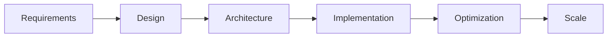

<div align="center">

# 🚀 Gopala Krishna Chennu


<br/>


</div>

---

## 💫 About Me

<div align="center">

```ascii
╔═══════════════════════════════════════════════════════════════════════════╗
║                                                                           ║
║   ARCHITECT · ENGINEER · INNOVATOR                                       ║
║                                                                           ║
║   Transforming complex problems into elegant, scalable solutions         ║
║   Specializing in cloud-native architectures, distributed systems,       ║
║   and AI-powered applications that drive business value                  ║
║                                                                           ║
╚═══════════════════════════════════════════════════════════════════════════╝
```

</div>

<br/>

<table>
<tr>
<td width="33%" align="center">

### 🎯 EXPERTISE
**Solution Architecture**  
Designing resilient, high-performance  
systems that scale effortlessly

</td>
<td width="33%" align="center">

### ⚡ SPECIALIZATION
**Data Engineering**  
Building real-time pipelines that  
transform data into insights

</td>
<td width="33%" align="center">

### 🚀 INNOVATION
**AI/ML Systems**  
Deploying intelligent solutions  
that drive automation

</td>
</tr>
</table>

<br/>

<div align="center">

```python
class GopalProfile:
    def __init__(self):
        self.role = "Solution Architect & Data Engineer"
        self.location = "Houston, TX"
        self.mission = "Building the future, one system at a time"
        
    def expertise(self):
        return {
            'architecture': ['Microservices', 'Event-Driven', 'Serverless'],
            'cloud': ['AWS', 'Azure', 'GCP', 'Multi-Cloud Strategy'],
            'data': ['ETL/ELT', 'Real-Time Streaming', 'Data Warehousing'],
            'ai_ml': ['Model Deployment', 'LLM Integration', 'MLOps']
        }
    
    def current_focus(self):
        return [
            'AI-Powered Applications',
            'Cloud-Native Microservices',
            'Real-Time Data Pipelines',
            'ML System Design'
        ]
```

</div>

---

## 🛠️ Tech Stack

<div align="center">

### ⚙️ CORE TECHNOLOGIES

<br/>

#### **Languages & Frameworks**


#### **Cloud & Infrastructure**


#### **Data & Analytics**


#### **AI/ML & Data Science**


#### **DevOps & Tools**


</div>

---

## 🎯 Current Focus

<div align="center">

### 🔥 ACTIVE DEVELOPMENT

</div>

<table>
<tr>
<td width="50%" valign="top">

#### 🚀 **PRODUCTION SYSTEMS**

```yaml
Status: LIVE & SCALING

Projects:
  - AI-Powered Applications
    └─ LLM Integration
    └─ Intelligent Automation
    └─ Natural Language Processing
    
  - Cloud-Native Architecture
    └─ Microservices Ecosystem
    └─ Event-Driven Design
    └─ Serverless Computing
    
  - Real-Time Data Pipelines
    └─ Stream Processing
    └─ ETL/ELT Workflows
    └─ Data Lake Architecture
    
  - ML Model Deployment
    └─ MLOps Pipeline
    └─ Model Monitoring
    └─ A/B Testing Framework
```

</td>
<td width="50%" valign="top">

#### ⚡ **NEXT GENERATION**

```yaml
Status: IN DEVELOPMENT

Innovations:
  - Advanced ML System Design
    └─ Distributed Training
    └─ Model Optimization
    └─ Feature Engineering
    
  - LLM Fine-tuning & RAG
    └─ Custom Model Training
    └─ Retrieval Systems
    └─ Prompt Engineering
    
  - Kubernetes at Scale
    └─ Auto-scaling
    └─ Service Mesh
    └─ GitOps Workflows
    
  - Infrastructure as Code
    └─ Multi-Cloud Terraform
    └─ Automated Provisioning
    └─ Cost Optimization
```

</td>
</tr>
</table>

---

## 💼 Professional Experience

<div align="center">

### 🏗️ EXPERTISE DOMAINS

</div>

<br/>

<details open>
<summary><b>🏛️ SOLUTION ARCHITECTURE</b></summary>

<br/>



**Core Competencies:**
- **Microservices Architecture**: Designing decoupled, independently deployable services with clear boundaries and APIs
- **Event-Driven Systems**: Building reactive architectures using message queues, event streaming, and pub-sub patterns
- **Serverless Solutions**: Implementing cost-effective, auto-scaling applications using AWS Lambda, Azure Functions
- **High-Availability Design**: Creating fault-tolerant systems with 99.99% uptime using redundancy and failover strategies
- **API Design & Management**: RESTful, GraphQL, and gRPC API development with comprehensive documentation
- **Security Architecture**: Implementing zero-trust models, encryption at rest/transit, and compliance frameworks

**Key Achievements:**
- ✅ Architected distributed systems serving 10M+ requests/day
- ✅ Reduced infrastructure costs by 40% through optimization
- ✅ Designed fault-tolerant systems with 99.99% uptime
- ✅ Led migration of monolithic applications to microservices

</details>

<details open>
<summary><b>☁️ CLOUD ENGINEERING</b></summary>

<br/>

**Multi-Cloud Expertise:**
- **AWS**: EC2, S3, Lambda, ECS/EKS, RDS, DynamoDB, CloudFormation, CloudWatch
- **Azure**: Virtual Machines, Blob Storage, Functions, AKS, Cosmos DB, ARM Templates
- **GCP**: Compute Engine, Cloud Storage, Cloud Functions, GKE, BigQuery

**DevOps & Automation:**
- **Container Orchestration**: Docker containerization, Kubernetes deployment, Helm charts, service mesh (Istio)
- **CI/CD Pipelines**: Jenkins, GitLab CI, GitHub Actions, ArgoCD for automated testing and deployment
- **Infrastructure as Code**: Terraform modules, CloudFormation templates, Ansible playbooks
- **Monitoring & Observability**: Prometheus, Grafana, ELK Stack, CloudWatch, Application Insights

**Key Implementations:**
- ✅ Deployed Kubernetes clusters managing 500+ microservices
- ✅ Automated infrastructure provisioning reducing deployment time by 70%
- ✅ Implemented comprehensive monitoring with 360° observability
- ✅ Established GitOps workflows for continuous delivery

</details>

<details open>
<summary><b>📊 DATA ENGINEERING</b></summary>

<br/>

**Data Pipeline Architecture:**
- **ETL/ELT Development**: Building robust data pipelines using Apache Airflow, AWS Glue, Azure Data Factory
- **Real-Time Streaming**: Kafka clusters, Spark Streaming, Flink for processing millions of events per second
- **Data Warehousing**: Snowflake, Redshift, BigQuery design with star/snowflake schemas
- **Data Lake Architecture**: S3/ADLS data lakes with Delta Lake for ACID transactions

**Big Data Technologies:**
- **Processing Frameworks**: Apache Spark, Hadoop, Presto/Trino for distributed computing
- **Workflow Orchestration**: Airflow DAGs, Prefect, Luigi for complex dependencies
- **Data Quality**: Great Expectations, custom validation frameworks, data lineage tracking
- **Performance Tuning**: Query optimization, partitioning strategies, indexing

**Key Projects:**
- ✅ Built real-time streaming pipelines processing 5TB+ daily
- ✅ Designed data warehouses supporting sub-second query performance
- ✅ Implemented data lakes with automated quality checks and governance
- ✅ Reduced ETL processing time from hours to minutes

</details>

<details open>
<summary><b>🤖 AI/ML SYSTEMS</b></summary>

<br/>

**Machine Learning Operations:**
- **Model Development**: Supervised/unsupervised learning, deep learning, time series forecasting
- **MLOps Pipeline**: Model versioning, experiment tracking (MLflow), automated retraining
- **Model Deployment**: Containerized deployments, API serving, batch inference
- **Monitoring & Governance**: Drift detection, performance tracking, model explainability

**AI Integration:**
- **Large Language Models**: GPT integration, RAG systems, fine-tuning open-source models
- **Computer Vision**: Object detection, image classification, video analytics
- **Natural Language Processing**: Sentiment analysis, named entity recognition, text generation
- **Recommendation Systems**: Collaborative filtering, content-based recommendations

**Production Systems:**
- ✅ Deployed ML models serving 1M+ predictions daily
- ✅ Built LLM-powered chatbots with 95% accuracy
- ✅ Implemented automated retraining pipelines
- ✅ Created feature stores for real-time ML inference

</details>

<br/>

---

## 📈 Professional Impact

<div align="center">

<table>
<tr>
<td align="center" width="25%">

### 🎯
**50+**  
Production Systems  
Architected & Deployed

</td>
<td align="center" width="25%">

### ⚡
**10M+**  
Daily Requests  
Processed & Served

</td>
<td align="center" width="25%">

### 💰
**40%**  
Cost Reduction  
Through Optimization

</td>
<td align="center" width="25%">

### 🚀
**99.99%**  
System Uptime  
Maintained

</td>
</tr>
</table>

</div>

---

## 🔗 Connect

<div align="center">

[](https://www.linkedin.com/in/gopala-krishna-chennu-89912b230/)
[](mailto:gopalakrishnachenu.usa@gmail.com)
[](https://github.com/gopalakrishnachennu)

<br/>
<br/>

```ascii
╔════════════════════════════════════════════════════════════════════╗
║                                                                    ║
║   💪 DISCIPLINE • CONSISTENCY • EXCELLENCE                        ║
║                                                                    ║
╚════════════════════════════════════════════════════════════════════╝
```

<br/>


</div>
